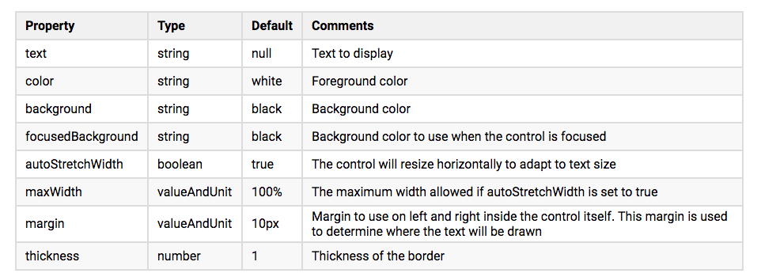
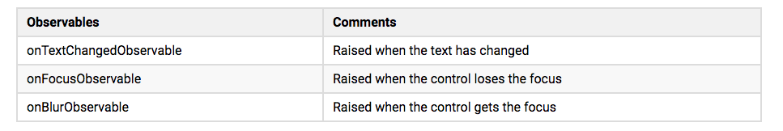
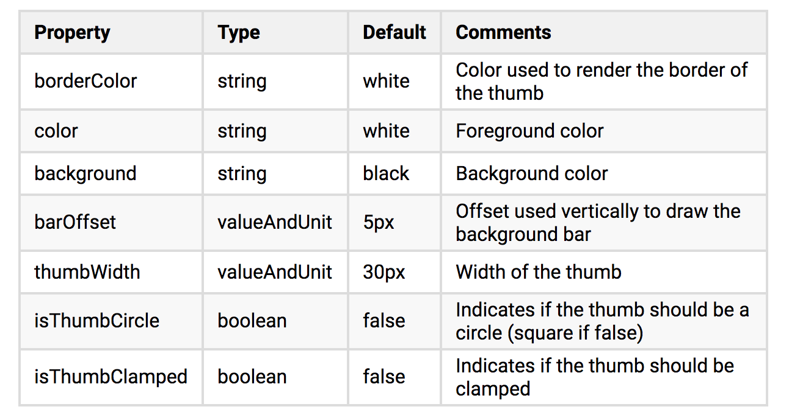
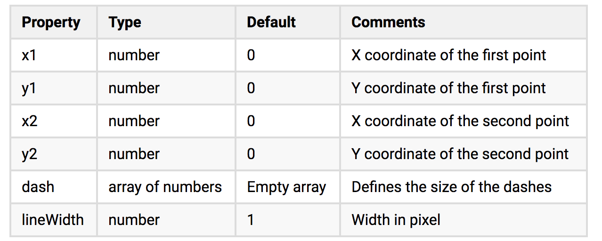
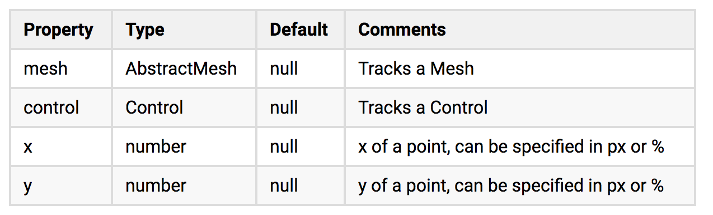
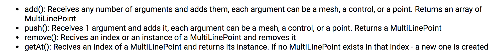
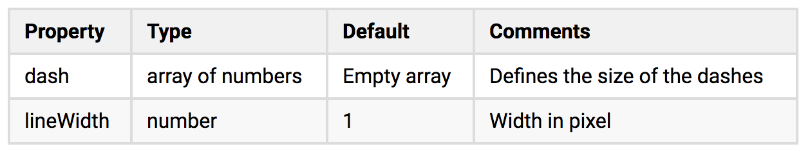

# 学习 Babylon GUI

## 目录

1. [AdvancedDynamicTexture](#advanceddynamictexture)
2. [一般属性](#一般属性)
3. [控件](#控件)
4. [容器](#容器)
5. [样式](#样式)

## AdvancedDynamicTexture

要使用 Babylon GUI 就必须要 AdvancedDynamicTexture 对象。

Babylon GUI 有两种模式：

- 全屏模式：在这种模式下，Babylon.GUI 将覆盖整个屏幕，并且将一直根据渲染的分辨率自动缩放。它能捕获点击（包括触摸）。
- 纹理模式：在这种模式下，BABYLON.GUI将作为某一个网格的纹理被使用。你必须定义你的纹理的分辨率。

### 全局模式(FullScreen)

```js
var advancedTexture = BABYLON.GUI.AdvancedDynamicTexture.CreateFullscreenUI("myUI");
```

渲染分辨率和控件之间比值默认为 1，如果想修改可以通过 `advancedTexture.renderScale` 修改。

同时还有个重要的属性 isForeground，它将决定你的控件渲染在场景的前面还是后面，默认是前面（也就是 isForeground = true）。

### 纹理模式(Texture)

全屏模式不适合 WebVR 一起使用，应为他是纯 2D 渲染，想要和 WebVR 一起使用你需要纹理模式

```js
var advancedTexture = BABYLON.GUI.AdvancedDynamicTexture.CreateForMesh(myPlane, 1024, 1024);
```

请注意在复杂的网格上处理指针移动事件对性能的消耗很大，所以你可以通过第四个参数来关闭对指针移动事件的支持。

```js
var advancedTexture = BABYLON.GUI.AdvancedDynamicTexture.CreateForMesh(myPlane, 1024, 1024, false);
```

有了这个对象你就可以添加控件了。

## 一般属性

### 事件

|事件|是否只在全屏模式下可用|触发条件|
|:---:|:---:|:---:|
|onPointerMoveObservable|是|光标在控件上移动|
|onPointerEnterObservable|是|光标移入控件|
|onPointerOutObservable|是|光标移出控件|
|onPointerDownObservable|否|指针在控件按下时|
|onPointerUpObservable|否|指针在控件按下抬起时|
|onPointerClickObservable|否|点击控件|

如果要忽视这些事件的话，给控件加一个 isHitTestVisible = false 就可以了。

同时，值得注意的是 onPointerMoveObservable, onPointerDownObservable, onPointerUpObservable, onPointerClickObservable 都会接收一个 2D 矢量坐标。

如果你想获取控件的坐标你可以用 `control.getLocalCoordinates(coordinates)`。

监听事件的基本代码为：

```js
control.onPointerMoveObservable.add(() => {
  // ...
});
```

### 文本对齐

|属性|默认值|说明|
|:---:|:---:|:---:|
|horizontalAlignment|BABYLON.GUI.Control.HORIZONTAL_ALIGNMENT_CENTER|可以设置成 left/right/center|
|verticalAlignment|BABYLON.GUI.Control.VERTICAL_ALIGNMENT_CENTER|可以设置成 left/right/center|

左： BABYLON.GUI.Control.HORIZONTAL_ALIGNMENT_LEFT
BABYLON.GUI.Control.VERTICAL_ALIGNMENT_LEFT
右： BABYLON.GUI.Control.HORIZONTAL_ALIGNMENT_RIGHT
BABYLON.GUI.Control.VERTICAL_ALIGNMENT_RIGHT

### 位置和大小

- potion:

  |属性|类型|默认值|默认单位|
  |:---:|:---:|:---:|:---:|
  |left|值加单位|0|px|
  |top|值加单位|0|px|

- size:

  |属性|类型|默认值|默认单位|
  |:---:|:---:|:---:|:---:|
  |left|值加单位|100%|百分比|
  |top|值加单位|100%|百分比|

- padding:

  |属性|类型|默认值|默认单位|
  |:---:|:---:|:---:|:---:|
  |paddingTop|值加单位|0px|px|
  |paddingBottom|值加单位|0px|px|
  |paddingLeft|值加单位|0px|px|
  |paddingRight|值加单位|0px|px|

### 追踪位置

在开发的过程中，我们想的应该是控件要跟着创建的模型走，而不是分开的形式。

```js
// 首先我们要将控件和模型关联起来
control.linkWithMesh(mesh);
// 然后控制控件相对于模型的位置
control.linkOffsetX;
control.linkOffsetY;
// 下面的方法是将控件移动到场景固定的位置
control.moveToVector3(position);
// 同时，可以将两个控件链接起来
line.connectedControl = control
```

但是要注意的是，这个功能只在全屏模式下有效。

### 旋转和缩放

|属性|类型|默认值|默认单位|
|:---:|:---:|:---:|:---:|
|rotation|number|0|弧度值|
|scaleX|number|1||
|scaleY|number|1||
|transformCenterX|number|0.5|定义 X 轴上的旋转中心，值为 0 - 1|
|transformCenterY|number|0.5|定义 Y 轴上的旋转中心，值为 0 - 1|

## 控件

控件分两种：

- 纯粹的 UI 控件：用于向用户展示信息或者提供动作，比如说 Button、TextBlock。
- 容器控件：被用于阻止你的控件，它包含了其他的控件。

所有的控件都有以下的属性：

|属性|类型|默认值|说明|
|:---:|:---:|:---:|:---:|
|alpha|number|1|值在 0 - 1 之间，0 表示完全透明，1 表示完全不透明|
|color|string|Black|前景色|
|fontFamily|string|Arial|字体可以被继承，如果你放在容器上就会被所有孩子继承|
|fontSize|number|18|可以被继承|
|fontStyle|string|-|可以被继承|
|fontWeight|string|-|可以被继承|
|zIndex|number|0|zIndex 可以重新排序 z 轴上的控件|
|shadowBlur|number|0|投影的模糊量|
|shadowOffsetX|number|0|x 轴阴影的偏移值|
|shadowOffsetY|number|0|y 轴阴影的偏移值|
|shadowColor|string|#000|投影的颜色|

```js
// 控件可以被添加到容器或者 AdvancedDynamicTexture 中
container.addControl(control);

// remove
container.removeControl(control);
// 控制控件是否显示
control.isVisible = false;
```

### TextBlock

这是一个简单的用来展示文字的控件。

这是它的一些属性：

|属性|类型|默认值|说明|
|:---:|:---:|:---:|:---:|
|lineSpacing|值和单位|0px|文本行之间的垂直距离|
|text|string|null|展示的文字|
|textWrapping|boolean|false|设置为 true 启动换行|
|resizeToFit|boolean|false|设置为 true 可以启用大小自适应|
|textHorizontalAlignment|number|BABYLON.GUI.Control.HORIZONTAL_ALIGNMENT_CENTER|可以设置成 left/right/center|
|textVerticalAlignment|number|BABYLON.GUI.Control.VERTICAL_ALIGNMENT_CENTER|可以被设置成 left/right/center|
|outlineWidth|number|0|文字轮廓大小，单位 px|
|outlineColor|string|"white"|文本轮廓颜色|

该控件提供了一个事件可以被监听：

|事件|触发条件|
|:---:|:---:|
|onTextChangedObservable|当文字改变的时候|

__需要注意的点：__

- 想要获得清晰的文本，需要确保渲染分辨率和屏幕保持一致
- lineSpaing 应该与 textWrapping 一起使用
- 当 resizeToFit 设置为 true 时，testWrapping 将被忽略

> 后面表格太多了，偷个懒直接上图片了

### InputText

属性：



事件：



要注意的是，由于 JavaScript 的限制，这个空间无法调用屏幕键盘，需要 prompt() 获取用户输入，可以通过 control.promptMessage 自定义标题。

### Button

- ImageButton: 图片加文本

    ```js
    var btn = BABYLON.GUI.Button.CreateImageButton('but', 'click me', "image.png");
    ```

- ImageWithCenterTextButton: 图片背景加文本居中

    ```js
    var btn = BABYLON.GUI.Button.CreateImageWithCenterTextButton('btn', 'click me', 'image.png');
    ```

- SimpleButton: 只有文本的按钮

    ```js
    var btn = BABYLON.GUI.Button.CreateSimpleButton('btn', 'click me');
    ```

- ImageOnlyButton: 图片按钮

    ```js
    var btn = BABYLON.GUI.Button.CreateImageOnlyButton('btn', 'image.png');
    ```

默认的效果是，在指针转换状态时改变其不透明度，并在点击时改变缩放比例。

### Checkbox

checkbox.isChecked 控制是否选中。
isChecked 改变能够触发 onIsCheckedChangedObservable 事件。

|属性|类型|默认值|说明|
|:---:|:---:|:---:|:---:|
|color|string|white|前景色|
|background|string|black|背景色|
|checkSizeRatio|number|0.8|计算内部复选框大小比例|

### RadioButton

一组单选按钮只能有一个为真，radiobutton.isChecked。改变值将会触发 onIsCheckedChangedObservable 事件。

|属性|类型|默认值|说明|
|:---:|:---:|:---:|:---:|
|color|string|white|前景色|
|background|string|black|背景色|
|checkSizeRatio|number|0.8|计算内部单选框大小比例|
|group|string|empty string|控制单选按钮是否为一组|

### Slider

滑块用来控制选择在范围中的值。使用 slider.minimum 和 slider.maximum 来控制范围。

值可以通过 slider.value 来设定，同时会触发 onValueChangedObservable 事件。



### Line

两个点之间画线。



### MultiLine

MultiLine 在网格、控件之间画线。

每个点的属性：



方法：



MultiLine 的属性：



### Image —— 图片

### VirtualKeyboard —— 虚拟屏幕按键（常用于 VR）

### Containers

container.background 设置容器背景色。

#### 适应大小

- adaptWidthToChildren
- adaptHeightToChildren

#### Rectangle —— 矩形容器

#### Ellipse —— 椭圆形容器

#### StackPanel —— 堆面板（以堆的形式展示）

#### ColorPicker —— 颜色选择器

#### Style —— 样式
