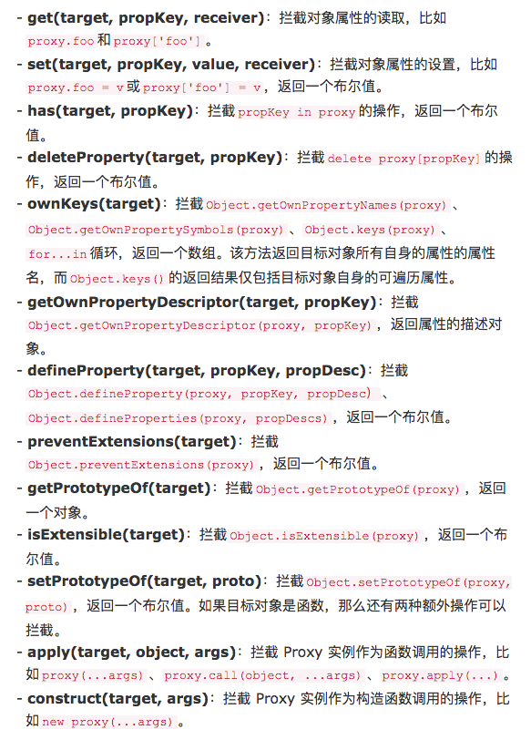

# ECMAScript 之 Proxy

> Proxy 顾名思义 —— 代理，那么他是如何使用的，以及它能够帮助我们完成哪些工作？这就是这次学习的目的。

实际上，在我理解了 Proxy 之后，与其说它是代理，不如说它是一个拦截器，它能够将我们对原始对象的一些操作拦截下来，然后进行修改，最后返回给我们。

## 举个栗子

小明代表这个对象，小刚是要去拜访小明的人，而小明的妈妈就是 Proxy。

那么，有一天，小刚来拜访小明了，但是呢，小明的妈妈把小刚拦了下来，就有了下面的对话：

小明妈说：“有啥事找我吧，我都知道。”

小刚问：“小明多少岁啊？”

小明妈说：“小明 15 岁。”

小刚又问：“小明有女朋友吗？”

小明妈一听，心想小明没有女朋友，但是我不能丢了面子，就说：“有女朋友。”

就像上面的对话一样，Proxy 可以对访问进行修改，最后再返回给访问者。我们可以根据访问者的需求来操作，可以是真实操作，也可以不是。

## 拦截器

那么，它是怎么使用的呢？

```js
const proxy = new Proxy(target, handler);
```

- __target:__ 这个参数就是被拦截的对象。
- __handler:__ 这是参数就是拦截的行为。

就那上面的例子来说：

```js
// 被拦截的对象： 小明
const xiaoming = {
  name: '小明',
  age: 15,
  hasGirlfriend: false,
};
// 拦截器： 小明的妈妈
const xm_mother = new Proxy(xiaoming, {
  // 三个参数分别是 目标对象、属性名称、proxy 实例
  get(target, key, receiver) {
      if(key === 'hasGirlfriend') {
          return true
      }
      return Reflect.get(target, key, receiver);
  },
});
// 小刚访问
xm_mother.age; // 15
xm_mother.hasGirlfriend; // true
```

在上面的代码中，小明就是参数中的 `target`，拦截器就是后面的对象，在这个对象里拦截了 `get` 操作。而 Proxy 一共支持以下 __`13`__ 种拦截操作。

## 可拦截操作

