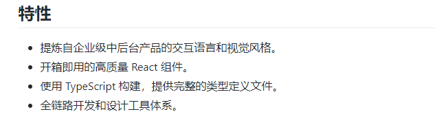
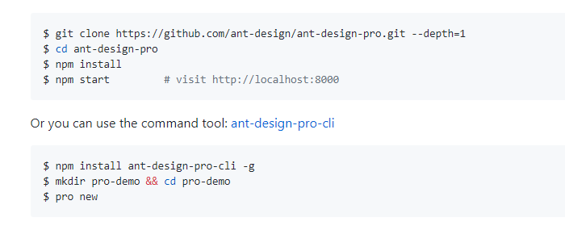
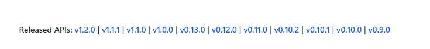

# 怎么写一个高逼格的 README

> 最近一个项目从程序员变成了一个高级文档哥，好吧，我还称不上高级，但是我发现写文档真不是一件容易的事情，要怎么写的让人看的舒服、巴适、爽的不行，看完就想给你个赞呢？我也总结了一下写文档的一些感想，也不能说是经验，毕竟小弟还年轻，哈哈。

编写一个项目的 README 就像是写一本书的序言一样，一个好的项目不应该仅仅只有一份高质量代码，同时更应该有一份高质量的文档。而对使用者来说，一份好的文档能够节省大量的时间。

## 国际化

要知道比如 GitHub 这样的代码托管平台，可是有着另一个名字，全世界最大的同性交友网站（技术基不说话），你的项目可能不止中国的程序猿在使用，一个好的项目，使用者来自世界各地，那么一份中英双语的文档至关重要。

毕竟对母语的文档有更加亲和的感觉，同时阅读起来会更加顺畅。

比如，Ant Design Pro 的文档：

## 项目是干什么的

首先，要有一个项目名，不一定要霸气，但是一定要朗朗上口，不会读起来很拗口，而且别太长。

比如说，chalk、react、vue、commander 等等。如果自己实在不知道怎么起，搞个随机函数，试试自己的运气吧。

当然了，如果你有 LOGO 是最好的了，一张高清大图 LOGO 帅一脸，看起来就舒服有木有。

就比如说这样：

或者这样：

再接下来，一个好的项目简介，能够帮助使用者了解他能够使用这个工具干什么，能不能满足自己的需求。一般来说，我们希望从简介中，了解下面一些信息：

- 什么语言写的？Node、Python 还是其他什么
- 这个项目的用途是什么
- 最新版本信息
- 构建、测试结果等信息
- Demo 演示地址或者官网

就像这样：

对于我们技术 README 一定要各种徽章砸脸上，比如标配的 travis、coverage、npm 等等，给人一种安全感，如果你自己测试构建都没过，我用着也不放心。至于这些东西大家可以去这儿看看：http://shields.io/

同时，我们要精要的总结项目的闪光点，有哪些特性是激动人心的，别人没有的，这是吸引用户的好方法。

比如这样：

## 安装及快速开始

这部分内容是是文档很重要的部分，通过这些步骤，能够让使用者快速的使用。

首先，你要告诉用户怎么去获取以及初始化项目，比如下面这样：

然后你需要给一个简单的例子，让使用者快速感受到使用它的好处：

当然了，在这个地方，最好最直观的方法就是放一张 gif 的图片，吸引用户的注意力，同时给用户展示使用结果，比如这样：

## API

API 是一个项目的灵魂，这是暴露给用户最直接的地方，当使用者有疑问的时候，他会第一时间去找你的 API 文档。

对于一个 API 应该表述清楚的是：

- 作用
- 入参及每个参数是否必须，数据类型是什么等等
- 返回值

如果你的 API 不多，那么可以放在一个文件里，但是如果你的 API 非常多，那么建议你将 API 单独放到一个文件里，这个文件留一个链接就可以。

同时，如果你的 API 有相当多个版本，那么需要准备几份 API 文档，应对不同的需求。

就比如这样：

## 版本变化

还有最好是能有一份 CHANGELOG 文档，对不同版本做了哪些修改，有什么特性等等，让用户知道每个版本干了什么。

就比如这样：

## FAQ

当然了，如果你不想回答一些非常重复的问题，我想你需要一份 FAQ 来记录一些常见问题。

## 贡献

我相信很多人跟我一样，能给一些知名仓库提交 PR 是一件比较自豪的事情。

所以如果能提供一个提交 PR 的方式或者是途径，能够吸引更多的人来贡献代码，同时将贡献者，展示出来，我想会有更多人愿意贡献出自己的力量。

比如在这样的列表中也是挺有意思的：

## 版权

相信前不久 Facebook 的开源协议事件也是闹得沸沸扬扬，所以，做好在项目中，将开源协议证书这些东西弄好。

## 总结

最后，总结一下，对于一份好的 README 来说，这些也许够了，也许不够，但是，文档始终是因为使用者才存在的东西，所以使用者关注什么，什么才是我们文档的重点。

但是这些基础是我们应该都需要的：

- 名字
- 简介
- 功能
- 安装配置
- 快速教程
- API 文档

这些是使用者都会去关心的点，应该在编写之前好好斟酌。