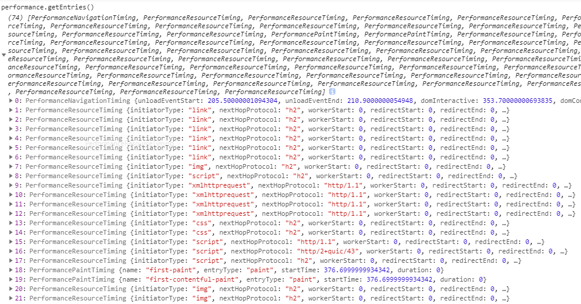
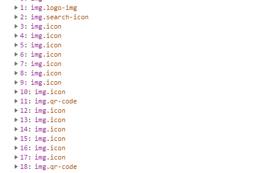

# 试炼之石 - Performance

> 最近在阅读 Vue 的源码的时候去溜达了一圈以前没有关注过的几个 API，比如 mark、measure 等等，于是总结一下前端监控利器 performance 相关的知识。

## 何为试炼之石？

可能有些同学不太了解这个 API，因为其实说实话，平常也不会接触这些，但是这却是一个很有用的 API。我们可以利用这个 API 完成对页面的性能表现达到十分精确的度量和控制。

下面呢，我们将会一起领略一下 performance 的魅力，关于 performance 的 API 等等的信息，网上其实说的已经非常多了，这里就不再赘述，有兴趣的可以自行查阅。

## 耗时统计

在 performance 中的 timing 对象里，存储了各种与浏览器性能有关的时间数据，我们可以通过其中的一些属性来获取到浏览器在不同阶段处理网页的耗时统计。

```js
const { timing } = performance;
const t = {};

// DNS 查询时间
t.dns = timing.domainLookupEnd - timing.domainLookupStart;
// 解析 DOM 树时间
t.dom = timing.domComplete - timing.domInteractive;
// 重定向时间
t.redirect = timing.redirectEnd - timing.redirectStart;
// 请求耗时
t.request = timing.responseEnd - timing.requestStart;
// 白屏时间
t.wait = timing.responseStart - timing.navigationStart;
```

其实我们能从这些时间里还能够得到非常多的信息，上面都是一些很常用的时间，我们可以从这些信息中获知整个页面的整体性能。

比如说，当 DNS 查询时间长时，这时候你就要考虑是不是使用的域名太多了，或者有没有做 DNS 预解析， 关于 DNS 预解析要注意的是在 HTTP 协议下 a 标签是默认开启的，而 HTTPS 是默认关闭的，需要自己开启。

当重定向时间长的时候，你就可以去看看代码里这样的情况，比如说 `https://baidu.com` 就会重定向到 `https://www.baidu.com`，当然了，重定向的情况不止这一种，还需要根据自身项目去优化重定向的时间。

当 DOM 解析时间过长的时候，你就要考虑你的 HTML 的结构是不是不合理。我们可以通过不同的时间去检测页面的各种性能，然后针对性的进行修改。

## 打点分析

先看一段 Vue 的源码：

```js
const perf = inBrowser && window.performance;
/* istanbul ignore if */
if (
  perf &&
  perf.mark &&
  perf.measure &&
  perf.clearMarks &&
  perf.clearMeasures
) {
  mark = tag => perf.mark(tag);
  measure = (name, startTag, endTag) => {
    perf.measure(name, startTag, endTag);
    perf.clearMarks(startTag);
    perf.clearMarks(endTag);
    perf.clearMeasures(name);
  };
}
```

可以看到，其实它封装的两个函数中使用到的就是 performance 中的 mark、measure、clearMarks 以及 clearMeasures 几个函数。

performance.mark() 和 performance.clearMarks() 是一组函数，我们可以通过使用 performance.mark() 来标记时间戳，我们可以通过这些时间戳的名字来计算两个时间戳中间所花费的时间。

而这样的计算方式是不是看着有点熟，是的，在 console 里的 time 和 timeEnd 也能够计时，但是没有 mark 和 measure 灵活。看下面的例子：

```js
function per() {
  performance.mark('per_begin');
  for (const a = 1; a < 10000; a++) {}
  performance.mark('per_end');
}
per(); // 这时候我们调用 performance.getEntriesByType('mark') 就可以看到刚刚我们标记的两个时间戳了
// 我们使用 measure 来计算这两个标记点之间所消耗的时间
performance.measure('per', 'per_begin', 'per_end'); // 通过 performance.getEntriesByName('per') 就可以看到 measure 的时间了
```

Vue 的源码中对这两个方法进行了封装，从实验中我们能够看到我们每次打点以及计算都会在 performance 里留下记录，Vue 封装的方法在计算完成之后将记录清除掉了。

这里有些同学可能就有点困惑了，你 measure 计算的时候计算了就直接 clear 了，这不就白计算了么？其实，在官方的 devTools 里使用了 PerformanceObserver 去监听 performance 的动作，所以监听到取完值，删掉也就没什么了。

就比如说这样：

```js
const observer = new PerformanceObserver(list => {
  list.getEntries().forEach(entry => {
    console.log(`${entry.name}: ${entry.duration}`);
  });
});
observer.observe({
  entryTypes: ['measure']
});
```

这样当我们调用 performance.measure 就会触发这个回调函数了。

## 资源监控

我们对前端的监控主要是两个方面。

第一就是运行错误，这个很明显就是我们代码写得有问题，出现了 bug，我们可以在一些可以预知返回结果的地方主动判断函数运行是否正确，其次我们可以通过 `try...catch...` 或者是 `window.onerror` 等方法来进行错误的监控。

第二个方面就是对前端加载的资源进行监控，比较常用的方法有 Object.onerror 来捕获错误，要注意的是资源的错误不会冒泡，就是说 window 是捕获不到的，那么还有些什么其他办法呢？当然有，下面说的一种资源监控的方式就要利用到我们的 performance 了。

顺便提一嘴，前端的错误我们可以通过比如说 Ajax 的方式上报，但是呢？写 Ajax 还是比较烦的，你还可以通过 Image 对象上报错误。好了，不扯远了，我们继续看 performance 怎么监控资源。

我们随便打开一个网站，就以掘金为例，我们打开浏览器控制台。

```js
// 在控制台输入
performance.getEntries();
```

我们可以得到下面的输出：



这个 API 返回的是全部加载成功的资源，那么同时我们可以通过 document 去拿到我们要加载的所有资源。



这时候，我们就能够通过这两个数组来看资源的加载情况了。

## 总结

performance 这个 API 出来时间也很长了，但是以前一直没有了解过这个 API，在阅读源码的过程中才看到，属于查缺补漏。

关于 performance 的相关资源都在下面，有兴趣的可以看看：

- MDN: https://developer.mozilla.org/zh-CN/docs/Web/API/Performance
- 使用性能 API 快速分析 web 前端性能: https://segmentfault.com/a/1190000004010453
- window.performance 详解: https://github.com/fredshare/blog/issues/5
