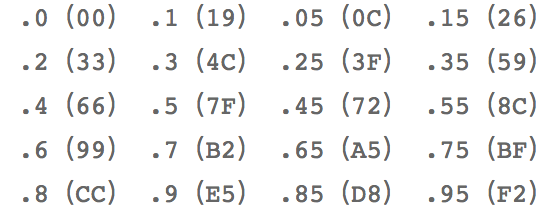

# 学习 faceUV 和 faceColors

## faceColors

其实 faceColors 没什么好说的，其实就是 RGBA，但是呢，它使用的是 0 - 1 的表达方式：



## faceUV

其实刚开始并不能理解 faceUV，后面看到这里也就理解了，这东西理解起来其实很简单，大家可以想象一张雪碧图，它的两条边就是两条坐标轴，取值范围为 0 - 1。


这是官方文档中的一张图，可以很形象的说明问题，假如说，我们要将立方体的某一个面变成其中的一张图片，我们需要哪些信息来确定位置呢？

Bingo，其实答案很简单，我们需要这张图对角的坐标就可以将这个图扣出来了，所以说 faceUV 的四个参数其实就是这对角的坐标。

```js
const faceUV = [];
// 参数依次是 U 轴左下坐标，V 轴左下坐标，U 轴右上，V 轴右上
faceUV[1] = new BABYLON.Vector4(Ubottom_left, Vbottom_left, Utop_right, Vtop_right);
```

其实这样大家理解的就差不多了，就像下面这个，经常会在示例中看到。

```js
faceUV[1] = new BABYLON.Vector4(0, 0, 1, 1);
```

其实上面这种写法就代表了整张图片。对了要提一点的是，faceUV 需要一张图片，没有图片，我们这个也就没用了。