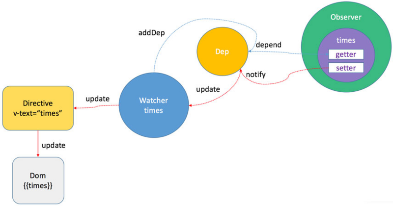

# 自己动手写一个 SimpleVue

> 最近看到一句话很有感触 —— 有人问 35 岁之后你还会在写代码吗？各种中年程序员的言论充斥的耳朵，好像中年就不该写代码了，但是我想说，若干年以后，有人问你闲来无事你会干什么，我想我会说，写代码，我想这个答案就够了，年龄不是你不爱的理由。

## 理论基础

双向绑定是 MVVM 框架最核心之处，那么双向绑定的核心是什么呢？核心就是 `Object.defineProperty` 这个 API，关于这个 API 的具体内容，请移步 [MDN - Object.defineProperty](https://developer.mozilla.org/zh-CN/docs/Web/JavaScript/Reference/Global_Objects/Object/defineProperty) ，里面有更详细的说明。

接下来我们来看一下 Vue 是怎么设计的：



图中有几个重要的模块：

- **监听者(Observer):** 这个模块的主要功能是给 data 中的数据增加 `getter` 和 `setter`，以及往观察者列表中增加观察者，当数据变动时去通知观察者列表。
- **观察者列表(Dep):** 这个模块的主要作用是维护一个属性的观察者列表，当这个属性触发 `getter` 时将观察者添加到列表中，当属性触发 `setter` 造成数据变化时通知所有观察者。 
- **观察者(Watcher):** 这个模块的主要功能是对数据进行观察，一旦收到数据变化的通知就去改变视图。

我们简化一下 Vue 里的各种代码，只关注我们刚刚说的那些东西，实现一个简单版的 Vue。

## Coding Time

我们就拿 Vue 的一个例子来检验成果。

```html
<body>
  <div id="app">
    <p>{{ message }}</p>
    <button v-on:click="reverseMessage">逆转消息</button>
  </div>
</body>
<script src="vue/index.js"></script>
<script src="vue/observer.js"></script>
<script src="vue/compile.js"></script>
<script src="vue/watcher.js"></script>
<script src="vue/dep.js"></script>
<script>
const vm = new Vue({
  el: '#app',
  data: {
    message: 'Hello Vue.js!'
  },
  methods: {
    reverseMessage: function () {
      this.message = this.message.split('').reverse().join('')
    }
  },
  mounted: function() {
    setTimeout(() => {
      this.message = 'I am changed after mounte';
    }, 2000);
  },
});
</script>
```

### new Vue()

首先，看 Vue 的源码我们就能知道，在 Vue 的构造函数中我们完成了一系列的初始化工作，以及生命周期钩子函数的设置。那我们的简易版 Vue 该怎么写呢？我们在使用 Vue 的时候是通过一个构造函数来开始使用，所以我们的简易代码也从构造函数开始。

```js
class Vue {
  constructor(options) {
    this.data = options.data;
    this.methods = options.methods;
    this.mounted = options.mounted;
    this.el = options.el;

    this.init();
  }

  init() {
    // 代理 data
    Object.keys(this.data).forEach(key => {
      this.proxy(key);
    });
    // 监听 data
    observe(this.data, this);
    // 编译模板
    const compile = new Compile(this.el, this);
    // 生命周期其实就是在完成一些操作后调用的函数,
    // 所以有些属性或者实例在一些 hook 里其实还没有初始化，
    // 也就拿不到相应的值
    this.callHook('mounted');
  }

  proxy(key) {
    Object.defineProperty(this, key, {
      enumerable: false,
      configurable: true,
      get: function() {
        return this.data[key]
      },
      set: function(newVal) {
        this.data[key] = newVal;
      }
    });
  }

  callHook(lifecycle) {
    this[lifecycle]();
  }
}
```

可以看到我们在构造函数中实例化了 Vue，并且对 data 进行代理，为什么我们要进行代理呢？原因是通过代理我们就能够直接通过 `this.message` 操作 message，而不需要 `this.data.message`，代理的关键也是我们上面所说的 `Object.defineProperty`。而生命周期其实在代码中也是在特定时间点调用的函数，所以我们做一些操作的时候也要去想想，它初始化完成没有，新手经常犯的错误就是在没有完成初始化的时候去进行操作，所以对生命周期的理解是非常重要的。

好了，完成了初始化，下面我们就要开始写如何监听这些数据的变化了。

### Observer

通过上面的认识，我们知道，Observer 主要是给 data 的每个属性都加上 `getter` 和 `setter`，以及在触发相应的 `get`、`set` 的时候执行的功能。

```js
class Observer {
  constructor(data) {
    this.data = data;
    this.init();
  }

  init() {
    this.walk();
  }

  walk() {
    Object.keys(this.data).forEach(key => {
      this.defineReactive(key, this.data[key]);
    });
  }
  
  defineReactive(key, val) {
    const dep = new Dep();
    const observeChild = observe(val);
    Object.defineProperty(this.data, key, {
      enumerable: true,
      configurable: true,
      get() {
        if(Dep.target) {
          dep.addSub(Dep.target);
        }
        return val;
      },
      set(newVal) {
        if(newVal === val) {
          return;
        }
        val = newVal;
        dep.notify();
        observe(newVal);
      }
    });
  }
}

function observe(value, vm) {
  if(!value || typeof value !== 'object') {
    return;
  }
  return new Observer(value);
}
```

在上面，我们完成了对 data 的监听，通过递归调用实现了对每个属性值的监听，给每个数据都添加了 setter 和 getter，在我们对数据进行取值或者是赋值操作的时候都会触发这两个方法，基于这两个方法，我们就能够做更多的事了。

现在我们知道了怎么监听数据，那么我们如何去维护观察者列表呢？我相信有些朋友和我一样，看到 get 中的 Dep.target 有点懵逼，这到底是个啥，怎么用的，带着这个疑问，我们来看看观察者列表是如何实现的。

### Dep

```js
class Dep {
  constructor() {
    this.subs = [];
  }

  addSub(sub) {
    this.subs.push(sub);
  }

  notify() {
    this.subs.forEach(sub => sub.update());
  }
}

Dep.target = null;
```

在 Dep 中我们维护一个观察者列表(subs)，有两个基础的方法，一个是往列表中添加观察者，一个是通知列表中所有的观察者。可以看到我们最后一行的 `Dep.target = null;`，可能大家会好奇，这东西是干什么用的，其实很好理解，我们定义了一个全局的变量 `Dep.target`，又因为 JavaScript 是单线程的，同一时间只可能有一个地方对其进行操作，那么我们就能够在观察者触发 `getter` 的时候，将自己赋值给 `Dep.target`，然后添加到对应的观察者列表中，这也就是上面的 `Observer` 的 `getter` 中有个对 `Dep.target` 的判断的原因，然后当 __Watcher__ 被添加到列表中，这个全局变量又会被设置成 `null`。当然了这里面有些东西还需要在 Watcher 中实现，我们接下来就来看看 __Watcher__ 如何实现。

### Watcher

在写代码之前我们先分析一下，Watcher 需要一些什么基础功能，Watcher 需要订阅 Dep，同时需要更新 View，那么在代码中我们实现两个函数，一个订阅，一个更新。那么我们如何做到订阅呢？看了上面的代码我们应该有个初步的认识，我们需要在 `getter` 中去将 Watcher 添加到 Dep 中，也就是依靠我们上面说的 `Dep.target`，而更新我们使用回调就能做到，我们看代码。

```js
 class Watcher {
  constructor(vm, exp, cb) {
    this.vm = vm;
    this.exp = exp;
    this.cb = cb;
    this.value = this.get();
  }

  get() {
    Dep.target = this;
    const value = this.vm.data[this.exp.trim()];
    Dep.target = null;
    return value;
  }

  update() {
    const newVal = this.vm.data[this.exp.trim()];
    if(this.value !== newVal) {
      this.value = newVal;
      this.cb.call(this.vm, newVal);
    }
  }
}
```

那么，我们有了 Watcher 之后要在什么地方去调用它呢？想这个问题之前，我们要思考一下，我们如何拿到你在 `template` 中写的各种 `{{message}}`、`v-text`等等指令以及变量。对，我们还有一个模版编译的过程，那么我们是不是可以在编译的时候去触发 `getter`，然后我们就完成了对这个变量的观察者的添加，好了说了那么多，我们来看下下面的模块如何去做。

### Compile 

Compile 主要要完成的工作就是把 template 中的模板编译成 HTML，在编译的时候拿到变量的过程也就触发了这个数据的 `getter`，这时候就会把观察者添加到观察者列表中，同时也会在数据变动的时候，触发回调去更新视图。我们下面就来看看关于 Compile 这个模块该怎么去完成。

```js
// 判断节点类型
const nodeType = {
  isElement(node) {
    return node.nodeType === 1;
  },
  isText(node) {
    return node.nodeType === 3;
  },
};

// 更新视图
const updater = {
  text(node, val) {
    node.textContent = val;
  },
  // 还有 model 啥的，但实际都差不多
};

class Compile {
  constructor(el, vm) {
    this.vm = vm;
    this.el = document.querySelector(el);
    this.fragment = null;
    this.init();
  }

  init() {
    if(this.el) {
      this.fragment = this.nodeToFragment(this.el);
      this.compileElement(this.fragment);
      this.el.appendChild(this.fragment);
    }
  }

  nodeToFragment(el) {
    // 使用 document.createDocumentFragment 的目的就是减少 Dom 操作
    const fragment = document.createDocumentFragment();
    let child = el.firstChild;

    // 将原生节点转移到 fragment
    while(child) {
      fragment.appendChild(child);
      child = el.firstChild;
    }
    return fragment;
  }

  // 根据节点类型不同进行不同的编译
  compileElement(el) {
    const childNodes = el.childNodes;
    
    [].slice.call(childNodes).forEach((node) => {
      const reg = /\{\{(.*)\}\}/;
      const text = node.textContent;

      // 根据不同的 node 类型，进行编译，分别编译指令以及文本节点
      if(nodeType.isElement(node)) {
        this.compileEl(node);
      } else if(nodeType.isText(node) && reg.test(text)) {
        this.compileText(node, reg.exec(text)[1]);
      }

      // 递归的对元素节点进行深层编译
      if(node.childNodes && node.childNodes.length) {
        this.compileElement(node);
      }
    });
  }

  // 在这里我们就完成了对 Watcher 的添加
  compileText(node, exp) {
    const value = this.vm[exp.trim()];
    updater.text(node, value);
    new Watcher(this.vm, exp, (val) => {
      updater.text(node, val);
    });
  }

  compileEl(node) {
    const attrs = node.attributes;
    Object.values(attrs).forEach(attr => {
      var name = attr.name;
      if(name.indexOf('v-') >= 0) {
        const exp = attr.value;
        // 只做事件绑定
        const eventDir = name.substring(2);
        if(eventDir.indexOf('on') >= 0) {
          this.compileEvent(node, eventDir, exp);
        }
      }
    });
  }

  compileEvent(node, dir, exp) {
    const eventType = dir.split(':')[1];
    const cb = this.vm.methods[exp];

    if(eventType && cb) {
      node.addEventListener(eventType, cb.bind(this.vm));
    }
  }
}
```

这就是 Compile 完成的部分工作，当然了这个模块不会这么简单，这里只是简单的实现了一点功能，如今 [Vue 2.0] 引入了 Virtual DOM，对元素的操作也不像这么简单了。

最后实现的功能由于我比较懒，大家可以自己写一写或者在我的 [GitHub 仓库](https://github.com/balancelove/SimpleVue)里可以看到。

## 总结

上面的代码也借鉴了前人的想法，但由于时间比较久了，所以我也没找到，感谢大佬提供思路。

Vue 的设计很有意思，在学习之中也能有很多不一样的感受，同时，在读源码的过程中，不要过多的追求读懂每一个变量，每一个句子。第一遍代码，先读懂程序是怎么跑起来的，大概是怎么走的，通读一遍，第二遍再去深究，扣一扣当时不清楚的东西，这是我看源码的一些心得，可能每个人的方法不一样，希望你能有所收获。

最后，因为 [Vue 2.0] 已经出来一段时间了，源码也有很多的变动，生命周期的变化、Virtual DOM 等等，还有比较感兴趣的 diff 算法，这些后续会继续研究的，谢谢。

[Vue 2.0]:https://cn.vuejs.org/v2/guide/

> 如果各位看官看的还行，可以到 [GitHub](https://github.com/balancelove/readingNotes) 里给我一颗小小的 star 支持一下，谢谢。
