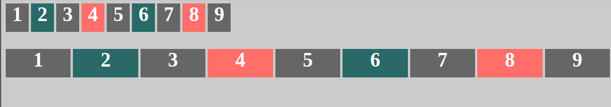

# Grid 布局发车啦

> Grid 布局又叫做网格布局，顾名思义是一种基于二维网格的布局方式，Grid 的强大令人兴奋，让我们一起来走进 Grid 的世界吧。

## 兼容性

好了，大家都坐好，我准备发车啦。不符合要求的同学请下车，没满 18 岁的，咳咳，开玩笑。不是所有人现在都能搭上 Grid 的小车车，毕竟项目兼容性问题很现实，不过不耽误我们学习。


我替大家翻译一下上面的浏览器都是啥，顺序从左到右：

- PC 端： Chrome、Edge、Firefox、IE、Opera、Safari
- 移动端： Android、Chrome for Android、Edge Mobile、Firefox for Android、Opera、IOS Safari、Samsung Internet

好了，大家看了看浏览器的兼容性就知道，如今主流浏览器都已经支持了 Grid 布局，还等啥呢？上车吧。

## 基本概念

乘客们，在开始了解用法之前，我们要了解一些 Grid 布局的基本概念，我想大家应该小时候都用过一种叫小字本的东西，这就是个正儿八经的网格。


- __Container:__ 网格容器，当我们设置 `display: grid;` 就将一个容器变成了网格容器，就比如说上面小字本里外层的那个绿框。
- __Item:__ 网格项，在我们设置的网格容器中的每一个子元素都是一个网各项。
- __Line:__ 网格线，顾名思义啦，这东西就是网格之间分界的线，就上小字本里的横着竖着的线。
- __Track:__ 网格轨道，两条相邻的网格线之间的空间，也就是网格的行或列。
- __Cell:__ 网格单元，两个相邻的行和列之间的区域，也就像是小字本里的每个小格子了。
- __Area:__ 网格区域，四条网格线包围起来的区域。

好了，基本概念了解的差不多了，我们去往下一站。

## 基本用法

第二站到了，我们要继续吹牛了。

本站要介绍的 api:

1. `grid-template-columns` 和 `grid-template-rows`
2. `grid-gap` -> `grid-row-gap` + `grid-column-gap`

第一件事，掏出代码：

```html
<div class="container">
  <div>1</div>
  <div>2</div>
  <div>3</div>
  <div>4</div>
  <div>5</div>
  <div>6</div>
</div>
```

```css
body {
  background: #CCCCCC;
}

.container > div {
  font-size: 35px;
  font-weight: bold;
  color: #fff;
  text-align: center;
  background: #666666;
}

.container > div:nth-child(2n) {
  background: #336666;
}

.container > div:nth-child(4n) {
  background: #f37e70;
}

.container {
  display: grid;
  grid-template-columns: 120px 120px 120px;
  grid-template-rows: 50px 50px;
}
```

好了，现在它长这个样子。


我们可以看出上面一些关键的 css 代码：

1. 使用 `display: grid;` 将外层容器变成一个网格布局容器。
2. 现在我们拥有了一个容器，我们现在要开始干什么了？对，没错，我们要开始把这个容器画成一个一个的格子。
3. `grid-template-columns: 120px 120px 120px;` 将容器画成 3 列，每列 120px；`grid-template-rows: 50px 50px;` 画成 2 行，每行 50px。

上面两个 api 给网格加上了两条横线，三条竖线，把容器画成了一个个的格子。然后将网格项一个一个填进去，那么聪明的同学又会想了，你这样画好格子，里面有 6 个格子，那我再添一个 div 会出现什么情况？好吧，满足这位同学的好奇心，我们加一个 div 进去。

然后就会变成这样：


神奇，是不是，明明俺就画了 6 个格子，居然 7 出现了，并且还有一定高度。其实在 grid 里，它有一个隐式网格轨道。

当我们的网格项处于我们没有定义的网格部分的时候，它会有一个默认的值，我们也可以选择去定义隐式网格轨道的大小，通过 `grid-auto-rows` 和 `grid-auto-columns` 来定义行和列，详细是什么样的我们下面再说。

讲完这个，我们再看看，每个格子挨得太近了，一点都不美观，咋办呢？我们加上 `grid-gap: 2px 4px;` 看看：


可以看到，使用这个属性我们定了网格的间隙，这个 api 其实是两个 api 的组合(`grid-column-gap` 和 `grid-row-gap`)。

好了，这一站就是基本用法，下面我们继续发车啦。

## fr 单位以及 repeat

上面我们通过一些基础的属性，写了一个 6 个格子的页面。这一节我们不讲属性，讲一下在 grid 中的一个单位值 — fr。那么这个 fr，代表的是什么意思呢？在 flex 中也有类似的属性，fr 的意思就是在自由空间进行分配的一个单位，那么是什么意思呢？

比如说，容器宽度为 1000px，现在假如 `grid-template-columns: 200px 1fr 1fr 2fr`。那么这就表示分了 4 列，第一列为 200px，然后剩下的 800px 就是自由空间了，经过计算可以得出 1fr 为 200px，这就是 fr 的意义。

那么，我们上面的例子其实可以这样写 `grid-template-columns: 1fr 1fr 1fr;`。但是现在又出现了一个问题，这个 1fr 写的好烦，能不能就写一个。

好消息，是有的，我们可以使用 repeat 来简写，于是上面的例子又可以改成 `grid-template-columns: repeat(3, 1fr)`。

说完这两个，我们继续下一站。

## 网格线的应用

这一站我们要说这些 api：

1. `grid-column` -> `grid-column-start` + `grid-column-end`
2. `grid-row` -> `grid-row-start` + `grid-row-end`

好了我们抛弃上面的例子，现在假如我们接到一个需求，我们要使用 3 栏布局，左右固定 200px，中间自适应，咋办呢？相信大家一下就想到了，毕竟大家都很聪明。

```html
<div class="container">
  <div>Left</div>
  <div>Main</div>
  <div>Right</div>
</div>
```

```css
// ...，跟上面相同的代码
.container {
  display: grid;
  grid-template-columns: 200px 1fr 200px;
  grid-template-rows: 500px;
  grid-gap: 2px 4px;
}
```

好了，现在我们是这样的：


需求又来了，我们要加上一个 header 和一个 footer，宽度是 main 的宽度，现在又怎么办呢？首先 container 需要改：

```css
.container {
  display: grid;
  grid-template-columns: 200px 1fr 200px;
  grid-template-rows: 100px 500px 100px;
  grid-gap: 2px 4px;
}
```

现在我们可以用网格线来进行布局了，在上面的网格布局中横向有 4 条网格线，竖向有 4 条网格线，默认网格会为编号，从 1 开始，于是我们可以用网格线将元素固定到它应该在的位置：

```css
/* 类名就是 html 对应的 div */
.left {
  grid-column: 1 / 2;
}
.main {
  grid-column: 2 / -2;
}
.right {
  grid-column: -2 / -1;
}
.header {
  grid-column: 2 / -2;
}
.footer {
  grid-column: 2 / -2;
}
```

这样的话，我们的布局就成了这样子：


在上面有一个小技巧，如果中间线比较多，你要选择比较靠后的线，就可以使用负数来进行选择。

上面的 1 和 2 的使用是差不多的，这里就不详述了。

注意，你可以给网格线取一些语义化的名字便于你使用，比如下面这样，footer 一样可以和 main 等宽：

```html
<div class="container">
  <div class="left">Left</div>
  <div class="main">Main</div>
  <div class="right">Right</div>
  <div class="footer">Footer</div>
</div>
```

```css
.container {
  display: grid;
  grid-template-columns: 200px [main-start] 1fr [main-end] 200px;
  grid-template-rows: 200px 200px;
  grid-gap: 2px 4px;
}

.footer {
  grid-column: main-start / main-end;
}
```

我们可以给网格线取名字，然后再去使用它。

## 网格区域应用

这节介绍的 api：

1. grid-template-areas
2. grid-area

我们可以通过另一种创建网格的方式来定位元素，就如同画图一样，就那上面那个有 header 和 footer 的例子来说，我们可以这么写：

```css
.container {
  display: grid;
  grid-template-columns: 200px  1fr  200px;
  grid-template-rows: 50px 300px 50px;
  grid-template-areas: 
    ". h ."
    "l m r"
    ". f .";
  grid-gap: 2px 4px;
}

.header {
  grid-area: h;
}
.left {
  grid-area: l;
}
.right {
  grid-area: r;
}
.main {
  grid-area: m;
}
.footer {
  grid-area: f;
}
```

通过这样的方式，我们一样能做到上面的那种定位操作，注意的是在 `grid-template-areas` 中 . 代表的是这个位置空着。

## repeat 进阶

在上面，我们说过一种 repeat 的简单用法，创建网格时重复指定的次数，但是有的时候我们并不想指定次数，而是希望自动填充，这时候怎么办呢？

这时候我们就要提到 `auto-fit` 和 `auto-fill` 了。

首先，我们通过 repeat 先把格子建出来：

```css
.container {
  display: grid;
  grid-template-columns: repeat(9, 1fr);
  grid-template-rows: 50px;
  grid-gap: 2px 4px;
}
```

这样我们就创建了一个基于 9 列的网格系统，如果我们的视窗不断变小，那么我们的每一格也会相应的变窄，我们不希望它变得非常窄，咋办呢？

Grid 有一个 minmax() 函数可以使用，这个函数接收两个参数，一个最小值，一个最大值，当浏览器窗口发生改变的时候，它能够保证该元素是在这个范围之内改变。比如说：

```css
.container{
  grid-template-columns: repeat(9, minmax(250px, 1fr));
}
```

当我们把 `grid-template-columns` 变成这样之后，每一列的宽度都会在 250px 到 1fr 之间，但是我们会发现，他装不下这些格子，但是它也没有换行，因为你告诉它有 9 列，于是出现了滚动条，但是你不希望出现这东西，咋办呢？

这时候就到了我们上面说的两个参数出场的时候到了。

```css
.container{
  grid-template-columns: repeat(auto-fill, minmax(250px, 1fr));
}
```

当我们加上这个参数过后，就会让浏览器去处理列宽和换行的问题，如果你给的容器宽度不够，它就会换行。

那么 fit 和 fill 有啥区别呢？我找了一些资料，里面有两句总结是这么说的：

`auto-fill` 倾向于容纳更多的列，所以如果在满足宽度限制的前提下还有空间能容纳新列，那么它会暗中创建一些列来填充当前行。即使创建出来的列没有任何内容，但实际上还是占据了行的空间。

`auto-fit` 倾向于使用最少列数占满当前行空间，浏览器先是和 auto-fill 一样，暗中创建一些列来填充多出来的行空间，然后坍缩（collapse）这些列以便腾出空间让其余列扩张。

做一个实验，当宽度足够大时，这两者区别就出来了：

```css
.container1{
  grid-template-columns: repeat(auto-fill, minmax(40px, 1fr));
}
.container2{
  grid-template-columns: repeat(auto-fit, minmax(40px, 1fr));
}
```



这样可以看出区别了，fill 是尽可能多容纳列，它会自己造一些列来填充剩余空间，其实它是铺满了的，只是你看不见而已，而 fit 是扩张原有列来铺满这一行。

至于具体详细的解释，大家可以去这篇[译文](http://www.colabug.com/2395888.html)看一看，说得非常详细了。

## 总结

好了，关于 grid 大概就说这么多了，其实关于这些 api 的使用还有很多的参数问题，这里没有细说，只是让大家知道 grid 能干嘛，至于详细的说明，可以去下面几个博客看一看。

另外还有一些属性没有介绍，是关于对齐等属性，大家在有需求的时候可以去下面的资料找到。

更多资料：

- CSS 网格布局学习指南: https://segmentfault.com/a/1190000012889793
- MDN: https://developer.mozilla.org/zh-CN/docs/Web/CSS/CSS_Grid_Layout。
- A Complete Guide to CSS Grid Layout(很详细的说明，不过是英文的): http://chris.house/blog/a-complete-guide-css-grid-layout/

> 如果各位看官看的还行，可以到 [我的博客仓库](https://github.com/balancelove/readingNotes) 里给我一颗小小的 star 支持一下，不胜感激。
